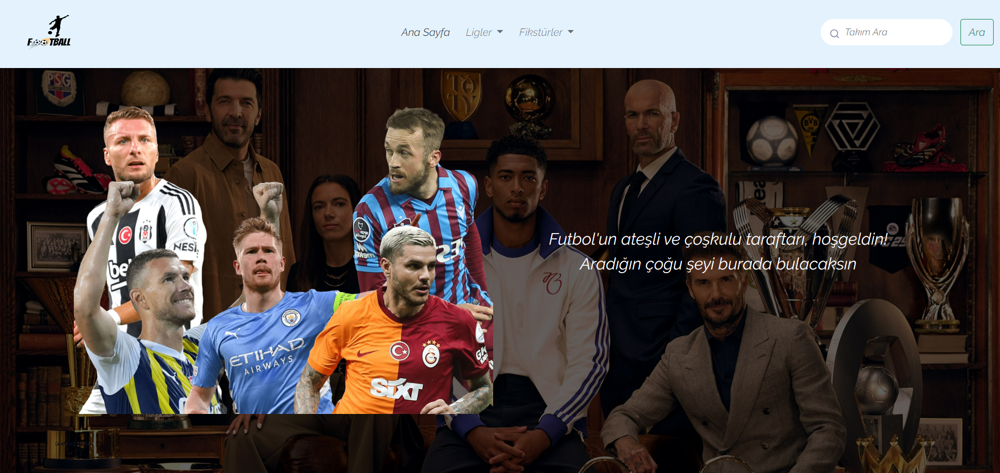
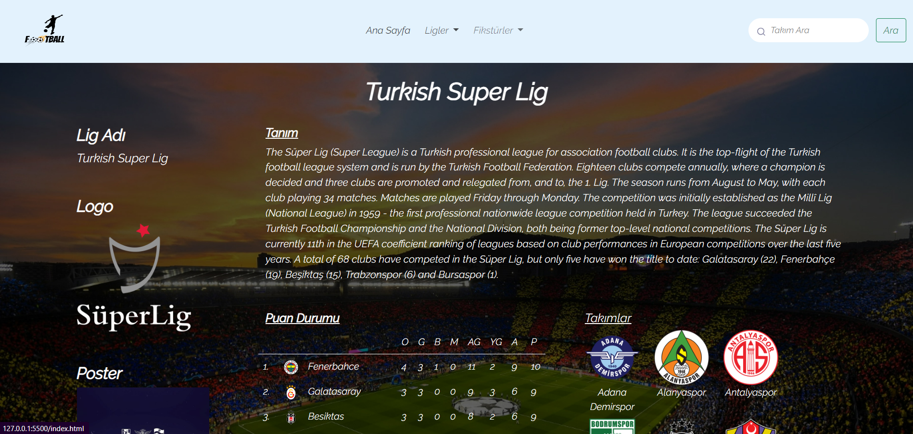
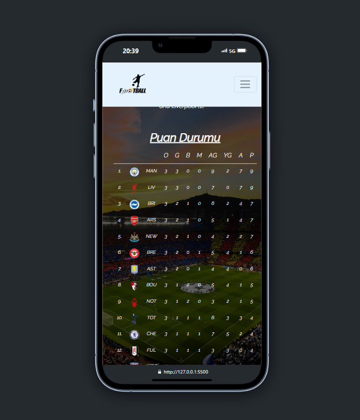
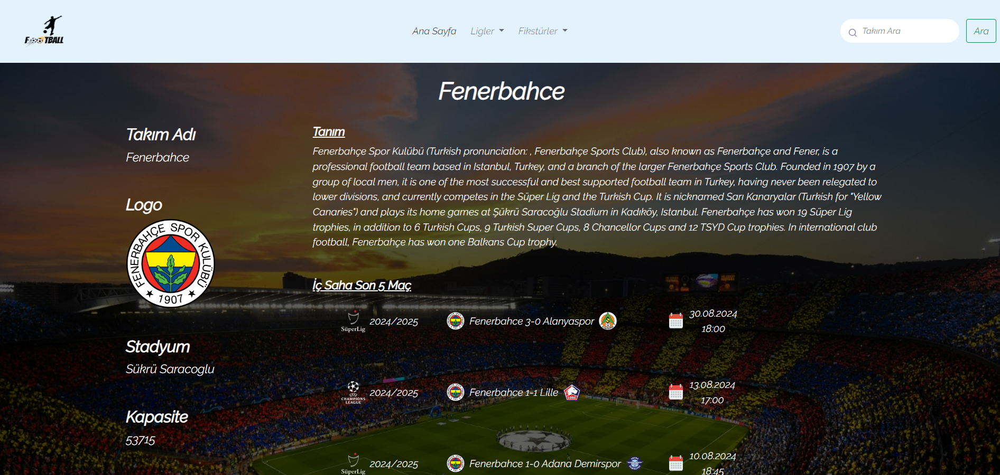
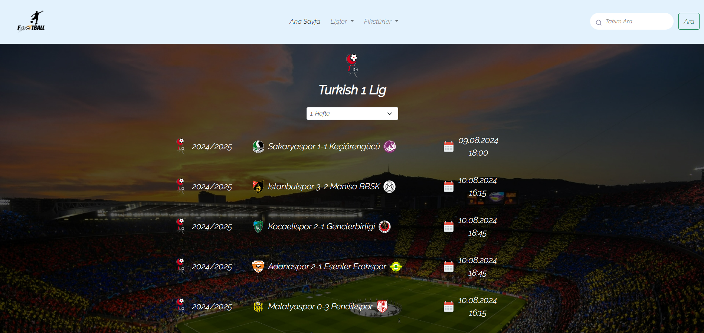
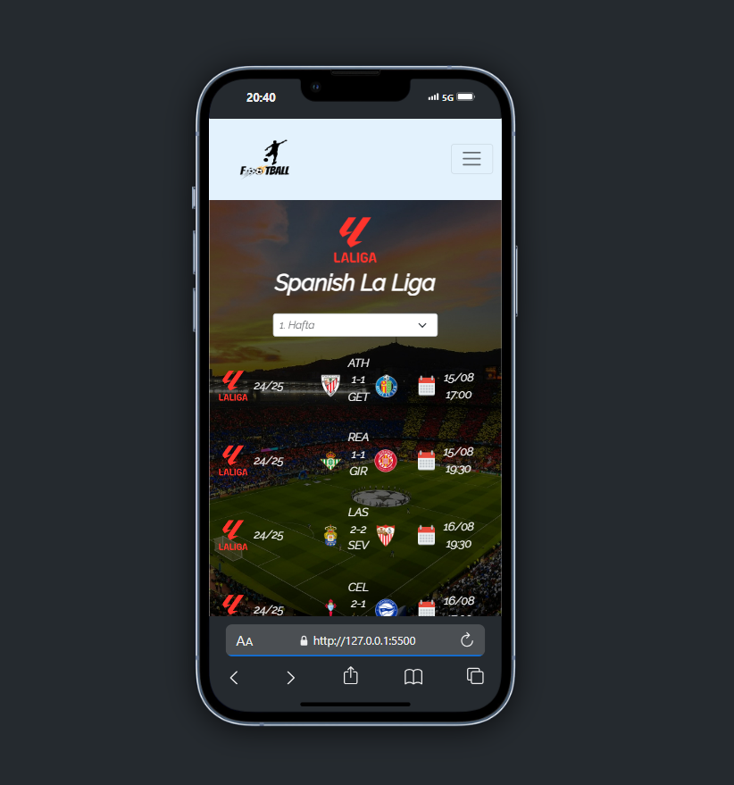
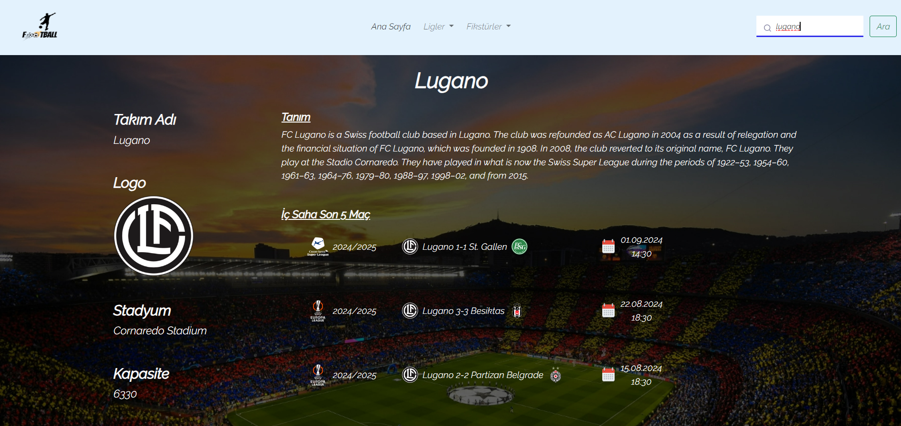

#
# FootballAPI'ye hoşgeldiniz!
## DEMO WEB SITE: https://football-api-six.vercel.app/
Merhaba, ben **İbrahim Koçal**. **FootballAPI**'a hoşgeldiniz. Bu projede Trendyol Süper Lig, 1.Lig ve diğer öncü futbol liglerine ait bilgileri, takımları, puan durumlarını, takımların son iç 5 saha maç sonuçlarını vs. görebileceksiniz. 
> **Not:** Bu veriler *thesportsdb*.com tarafından alınmaktadır. Verilerin güncel veya eksik olup olmama durumu siteden kaynaklı olabilir.

### Programlamlama Dilleri 
Bu platformu oluştururken, **HTML**, **CSS & SCSS**, **JavaScript**, **Bootstrap** kullandım. İçerisinde dropdown, collapse, carousel ve owl-caroulsel gibi yapılar bulunmakta.
> **Not:** Bu tasarımda **Bootstrap 5.0.2** versiyonu kullanılmıştır.

## ANA SAYFA
**Ana Sayfa**, FootballAPI sayfasının giriş sayfası, üzerinde çok bir şeyler eklemeye gerek duymadım.

## LİGLER
**Ligler** sayfası, Trendyol Süper Lig, Trendyol 1.Lig ve daha önde gelen futbol liglerinin bulunduğu kısım. Burada lig tanıtımı (kuruluş tarihi, ülke vs.), puan durumu ve takımlar bulunmakta. Ligin takımlarına ait bilgileri de takımlara tıklayarak ulaşabiliyorsunuz.
> **Not:** Puan durumundan takımın üstüne tıklayabilir veya yanda bulunan **Takımlar** bölümünden takım logosuna veya ismine tıklayarakta ulaşabilirsiniz.

## FİKSTÜRLER 
**Fikstürler**, liglere ait ilk 10-12 haftalık maç fikstürlerini vermektedir. Seçtiğiniz ligin fikstürüne ulaştıktan sonra, seçeceğiniz haftanın maçları gelmektedir.

**NOT**: **Ligler** veya **Fikstürler** kısmında bulunmayan bir takımı **"Arama"** kısmında aratarak bulabilirsiniz.

***
# Welcome to FootballAPI!
Hello, I am **İbrahim Koçal**. Welcome to **FootballAPI**. In this project, Trendyol Super League, 1st League and other leading football leagues' information, teams, standings, last 5 home match results of the teams, etc. you will be able to see. 
> **Note:** This data is obtained by *thesportsdb*.com. Whether the data is current or incomplete may depend on the site.

### Programming Languages 
While creating this platform, I used **HTML**, **CSS & SCSS**, **JavaScript**, **Bootstrap**. It contains structures such as dropdown, collapse, carousel and owl-caroulsel.
> **Note:** **Bootstrap 5.0.2** version was used in this design.

## HOME PAGE
**Home Page** is the home page of the FootballAPI page, I did not need to add much to it.

## LEAGUES
**Leagues** page is where Trendyol Super League, Trendyol 1st League and other leading football leagues are located. Here you can find the league introduction (date of establishment, country, etc.), standings and teams. You can also access information about the league's teams by clicking on the teams.
> **Note:** You can click on the team from the score table or click on the team logo or name in the **Teams** section on the side.

## FIXTURES 
**Fixtures** gives the fixtures for the first 10-12 weeks of the leagues. After you reach the fixtures of the league you selected, the matches of the week you selected will appear.

**NOTE**: You can find a team that is not available in the **Leagues** or **Fixtures** section by searching in the **"Search"** section.

